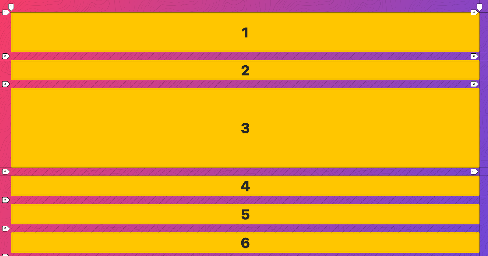
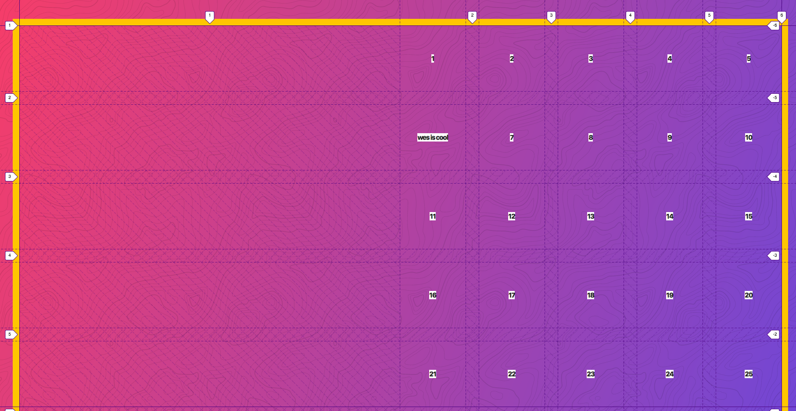
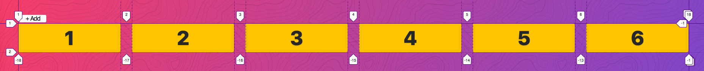

<!-- START doctoc generated TOC please keep comment here to allow auto update -->
<!-- DON'T EDIT THIS SECTION, INSTEAD RE-RUN doctoc TO UPDATE -->
**Table of Contents**  *generated with [DocToc](https://github.com/thlorenz/doctoc)*

- [CSS Grid](#css-grid)
  - [Setup](#setup)
  - [CSS Grid Fundamentals](#css-grid-fundamentals)
  - [CSS Grid Dev Tools](#css-grid-dev-tools)
  - [Implicit vs Explicit Tracks](#implicit-vs-explicit-tracks)
  - [Grid auto-flow Explained](#grid-auto-flow-explained)
  - [Sizing Tracks](#sizing-tracks)
  - [Repeat Function](#repeat-function)
  - [Sizing Grid Items](#sizing-grid-items)
  - [Placing Grid items](#placing-grid-items)
  - [Spanning and Placing Cardio](#spanning-and-placing-cardio)
  - [auto-fit and auto-fill](#auto-fit-and-auto-fill)
  - [Using minmax() for Responsive Grids](#using-minmax-for-responsive-grids)
  - [Grid Template Areas](#grid-template-areas)
  - [Naming Lines in CSS Grid](#naming-lines-in-css-grid)
  - [grid-auto-flow dense Block Fitting](#grid-auto-flow-dense-block-fitting)
  - [CSS Grid Alignment + Centering](#css-grid-alignment--centering)
    - [Center div](#center-div)
  - [Re-ordering Grid Items](#re-ordering-grid-items)
  - [Nesting Grid with Album Layouts](#nesting-grid-with-album-layouts)
  - [CSS Grid Image Gallery](#css-grid-image-gallery)
  - [Flexbox vs CSS Grid](#flexbox-vs-css-grid)
  - [Reacreating Codepen](#reacreating-codepen)
  - [Bootstrappy Grid with CSS Variables](#bootstrappy-grid-with-css-variables)
  - [Responsive Website](#responsive-website)

<!-- END doctoc generated TOC please keep comment here to allow auto update -->

# CSS Grid

> My notes from CSS Grid [course](https://cssgrid.io/) with Wes Bos.

[#griddyup](https://twitter.com/hashtag/griddyup?src=hash)

Course will use Firefox - best CSS Grid debugging tools. Recommend Developer Edition.

## Setup

[Starter Files + Solutions](https://github.com/wesbos/css-grid)

Will use browsersync to auto refresh browser.

Run `npm install`, then `npm start` to open FirefoxDeveloperEdition at [localhost:7777](http://localhost:7777/)

Note base stylesheet uses css variables:

```css
code:root {
  --yellow: #ffc600;
  --black: #272727;
}
```

## CSS Grid Fundamentals

[Example](03%20-%20CSS%20Grid%20Fundamentals/css-grid-fundamentals-START.html)

Take any element such as `<div>` and add `display: grid` in css. Then you can slice/dice grid into a grid of rows and columns, where items can be placed *anywhere* in grid. Can also span multiple rows/cols.

Rows/cols are *tracks*. Content can be laid out within tracks without css positioning.

Emmet trick to get 10 divs with values 1 through 10 inside of them:

```
.container>.item{$}*10
```

```html
<div class="container">
  <div class="item">1</div>
  <div class="item">2</div>
  <div class="item">3</div>
  <div class="item">4</div>
  <div class="item">5</div>
  <div class="item">6</div>
  <div class="item">7</div>
  <div class="item">8</div>
  <div class="item">9</div>
  <div class="item">10</div>
</div>
```

When putting `display: grid` on a div (container), all its direct children become css grid item (no need to add display property on the direct children).

Define columns, for example to specify 3 columns each of width 100px:

```css
.container{
  display: grid;
  grid-template-columns: 100px 100px 100px;
}
```


Rows are automatically created as child items fill up the columns (more on *implicit grid* later).

`grid-gap: 20px` will add space between each column and row. Similar to margin, adds space between each *track*.

```css
.container {
  display: grid;
  grid-gap: 20px;
  grid-template-columns: 100px 100px 100px;
}
```


If column width is defined as wider than content inside it, by default, items inside will stretch to column width.

Can mix and match units on column widths, for example, `rem`, percentages (but don't use, will have `fr` unit to replace that).

Can also use `auto` for column widths:

```css
.container {
  display: grid;
  grid-gap: 20px;
  grid-template-columns: 100px auto 500px 50px;
}
```


Second column will automatically take up whatever leftover space after the fixed width columns are laid out. Can use for fluid/responsive layout. Good for common layout such as fixed sidebar (eg: 300px), then main content area, "the rest" of the view.

Can use `repeat` function, for eg: 5 columns of 100px each:

```css
.container {
  display: grid;
  grid-gap: 20px;
  grid-template-columns: repeat(5, 100px);
}
```


Can also specify rows:

```css
.container {
  display: grid;
  grid-gap: 20px;
  grid-template-rows: 100px 50px 200px;
}
```



Note this will make items go all the way across because there are no more columns specified. If you don't specify number of columns, then only get one.

## CSS Grid Dev Tools

[Example](04%20-%20CSS%20Grid%20Dev%20Tools/dev-tools-START.html)

Difficult to visualize because grid parts such as columns, rows, tracks, gaps etc are not DOM elements so they can't be inspected like regular DOM elements.

Right-click to inspect grid element. In Rules tab where `display: grid` is shown, can click on grid icon to toggle CSS Grid Highlighter.

Also on Layout tab, shows all the grids. Clicking the checkbox beside the grid in Layout tab will also toggle CSS Grid Highlighter.
Displays lines overlapping on grid. Displays where tracks are.

In Grid Display Settings:
- always check `Display line numbers` - shows row and column numbers as tags,
- `Display area names` - we don't have any yet, will get to that later.
- `Extend lines infinitely` - extends track lines to end of viewport, can be difficult to see on top of what you already have, but can modify the line colors by clicking on color circle beside grid item in Layout tab. Easiest to see in most layouts is black.

To distinguish various patterns in the lines (can be subtle), use Mac zoom accessibility (Cmd Option +/-) to zoom entire display in/out.

Note if create a grid with two columns, numbered labels from dev tools will show: 1, 2, 3. Tracks are numbered not by column/row itself, but by lines that start and stop them, so will always be one more number displayed than actual number of columns or rows.

Notice there are different kinds of lines:

- Solid line: Start and stop of *explicit* grid.
- Dashed diagonal line: Gaps
- Dashed line: Explicit track (eg: dark dashed lines going vertical are explicitly created columns)
- Dotted lines: Implicit track (eg: if only have columns but enough items that it creates new rows, those are implicit)

## Implicit vs Explicit Tracks

In the example below, there are *explicitly* defined columns, but rows have not, therefore the rows are *implicit*:

```css
.container {
  display: grid;
  grid-gap: 20px;
  grid-template-columns: 200px 400px;
}
```

So if html has more than two grid items to be placed in the grid container, for eg:

```html
<div class="container">
  <div class="item">1</div>
  <div class="item">2</div>
  <div class="item">3</div>
  <div class="item">4</div>
</div>
```

Browser will place:
- first item in first column (explicit)
- second item in second column (explicit)
- third item gets wrapped, creating a second row (implicit)
- fourth item gets wrapped, creating second row, (implicit)

Note how the dotted lines in dev tools for implicit change to dashed lines for explicit if css is modified to also explicitly define rows:

```css
.container {
  display: grid;
  grid-gap: 20px;
  grid-template-columns: 200px 400px;
  grid-template-rows: 100px 200px;
}
```

If more items are added than can fill the explicit grid, will expand grid beyond the explict end point (solid line), and create an implicit row to place the additional items.

To size implicity created rows:

```css
.container {
  ...
  grid-auto-rows: 500px;
}
```

Note: Open FF issue - unable to define size of multiple implicit rows, this will get crossed out, but it does work in Chrome:

```css
.container {
  ...
  grid-auto-rows: 500px 200px;
}
```

Also have `grid-auto-columns: 100px;`

But just adding that doesn't do anything in this example. By default, define explicit columns, and any extra items are turned into rows. `grid-auto-flow` can change this behaviour (more in next section).

## Grid auto-flow Explained

[Example](06%20-%20CSS%20grid-auto-flow%20Explained/autoflow-START.html)

Set whether another row or column should be added after explicit items have been laid out and getting into implicit items. Default is `grid-auto-flow: row`. Then additional items create new implicit rows. But `grid-auto-flow: column` will place additional items in new columns (enough new columns will scroll horizontally).

Given `grid-auto-flow: column`, then can also use `grid-auto-columns: 200px;` to specify how wide implicitly created columns should be.

Similar to `flex-direction` in Flexbox.

## Sizing Tracks

[Example](07%20-%20Sizing%20tracks%20in%20CSS%20Grid/sizing-tracks-START.html)

Trying to use percentage sizing on columns will create some horizontal scroll, due to gaps, eg:

```css
.container {
  display: grid;
  grid-gap: 20px;
  grid-template-columns: 25% 25% 25% 25%;
}
```

A better approach is `fr` (fractional) unit. fr represents the amount of space left *after* all elements are laid out. eg,
below will use 100% of remaining width for 3rd column, after first two columns of 200px each are laid out.

```css
.container {
  .container {
    height: 600px;
    border: 10px solid var(--yellow);
    display: grid;
    grid-gap: 20px;
    grid-template-columns: 200px 200px 1fr;
  }
}
```


Below will first lay out first column of 200px, then divide remaining space equally between 2nd and 3rd columns.

```css
.container {
  height: 600px;
  border: 10px solid var(--yellow);
  display: grid;
  grid-gap: 20px;
  grid-template-columns: 200px 1fr 1fr;
}
```


`fr` units work similarly to `flex-grow` and `flex-shrink` in Flexbox. i.e. `fr` units are in *proportion* to how much free space is left.

Below, 2nd column will get twice as much of the free space left as first column.

```css
.container {
  height: 600px;
  border: 10px solid var(--yellow);
  display: grid;
  grid-gap: 20px;
  grid-template-columns: 200px 2fr 1fr;
}
```


If want all columns evenly distributed across free space, don't use pixels at all, use `fr` units:

```css
.container {
  height: 600px;
  border: 10px solid var(--yellow);
  display: grid;
  grid-gap: 20px;
  grid-template-columns: 1fr 1fr 1fr 1fr;
}
```


Note adding `grid-template-rows: 1fr 1fr 1fr 1fr;` won't immediately change anything. Because default `height` of grid is however high the content is, but default width is viewport width.

To see effect of `grid-template-rows`, can add explicit height to grid, in this case 2nd row will take up 10x more free space than the others, distributed across a height of 600px, minus grid gap:

```css
.container {
  height: 600px;
  border: 10px solid var(--yellow);
  display: grid;
  grid-gap: 20px;
  grid-template-columns: 1fr 1fr 1fr 1fr;
  grid-template-rows: 1fr 1fr 1fr 1fr;
}
```

Can also use `auto` keyword combined with `fr`. `auto` will adjust column to max size of the content (i.e. ALL items in the column will get wider), then `1fr` will use all of the remaining free space:

```css
.container {
  .container {
    border: 10px solid var(--yellow);
    display: grid;
    grid-gap: 20px;
    grid-template-columns: auto 1fr;
  }
}
```


## Repeat Function

[Example](08%20-%20CSS%20Grid%20repeat%20function/repeat-START.html)

Instead of specifying `1fr` four times to get four columns:

```css
.container {
  display: grid;
  grid-template-columns: 1fr 1fr 1fr 1fr;
}
```

Use `repeat` function to specify how many times you want to repeat and what should be repeated, eg:

```css
.container {
  display: grid;
  grid-template-columns: repeat(4, 1fr);
}
```


To get 8 columns alternating between `1fr` and `2fr`:

```css
.container {
  display: grid;
  grid-template-columns: repeat(4, 1fr 2fr);
}
```


Can mix and match regular columns with repeat function:

```css
.container {
  display: grid;
  grid-template-columns: 100px repeat(2, 1fr auto) 200px;
}
```

## Sizing Grid Items

[Example](09%20-%20Sizing%20Grid%20Items/sizing-items-START.html)

Setting an explicit width on an item within a grid (or placing longer content in it) will make the entire column that wide, not just that item:

```css
.item9 {
  background: mistyrose;
  width: 500px;
}
```


To only affect a single item, use *spanning*, to tell an item to be a specific width. eg, for a single item in a grid to take up two columns: Will start where it naturally starts and then flow into next slot:

```css
.item9 {
  background: mistyrose;
  grid-column: span 2;
}
```


If you set span to value greater than there is space on that row, it will bump item down to next row and leave a gap:

```css
.item9 {
  background: mistyrose;
  grid-column: span 2;
}
```


Can also span rows:

```css
.item9 {
  background: mistyrose;
  grid-column: span 2;
  grid-row: span 2;
}
```


If you span more columns than are available, will force grid to be larger. eg: 5 column grid, but span 10:

```css
.container {
  display: grid;
  grid-gap: 20px;
  grid-template-columns: repeat(5, 1fr);
}

.item9 {
  background: mistyrose;
  grid-column: span 10;
}
```


## Placing Grid items

[Example](10%20-%20Placing%20Grid%20Items/placing-START.html)

`grid-column: span 2` is actually shorthand of two values: `grid-column-start: span 2` and `grid-column-end: auto`.

To specify `grid-column-start` and end explicitly, can use *track values.* For example, to start a particular item at column 2, it will layout all the items before it, then start the item at 2:

```css
.poop {
  grid-column-start: 2;
  background: #BADA55;
}
```


Can also specify end:

```css
.poop {
  background: #BADA55;
  grid-column-start: 2;
  grid-column-end: 5;
}
```


Short hand version of start/end:

```css
.poop {
  background: #BADA55;
  grid-column: 2 / 5;
}
```

Can also combine start/end with span, eg: start at track 2 and then span for 2 columns:

```css
.poop {
  background: #BADA55;
  grid-column: 2 / span 2;
}
```


If don't know how many tracks there will be, can specify to end at last track, eg: start at 1 and go to end (roughly like width: 100%)

```css
.poop {
  background: #BADA55;
  grid-column: 1 / -1;
}
```


To go to second last track, use `-2`:

```css
.poop {
  background: #BADA55;
  grid-column: 1 / -2;
}
```


Can mix and match this with rows:

```css
.poop {
  background: #BADA55;
  grid-column: 1 / -4;
  grid-row: 3 / span 3;
}
```


Note that `-1` for `grid-row` will only go to end of *explicit* grid (in this example, 5 rows):

```css
.container {
  display: grid;
  grid-gap: 20px;
  grid-template-columns: repeat(5, 1fr);
  grid-template-rows: repeat(5, 1fr);
}

.poop {
  background: #BADA55;
  grid-column: span 2;
  grid-row: 1 / -1;
}
```


## Spanning and Placing Cardio

[Example](11%20-%20Spanning%20and%20Placing%20Cardio/get-sweaty-START.html)

Given html:

```html
<div class="container">
  <div class="item item1">1</div>
  <div class="item item2">2</div>
  <div class="item item3">3</div>
  ...
  <div class="item poop">💩</div>
  <div class="item item9">9</div>
  <div class="item item10">10</div>
  <div class="item item11">11</div>
  ...
  <div class="item item30">30</div>
</div>
```

And css:

```css
.container {
  display: grid;
  grid-gap: 20px;
}
```

***NOTE: Exercises are cumulative!***

**Make the grid 10 columns wide, every other taking up twice the free space**

```css
.container {
  display: grid;
  grid-gap: 20px;
  grid-template-columns: repeat(5, 1fr 2fr);
}
```


**Make the grid have 10 explicit rows, 50px high each**

```css
.container {
  display: grid;
  grid-gap: 20px;
  /* Make the grid 10 columns wide, every other taking up twice the free space */
  grid-template-columns: repeat(5, 1fr 2fr);
  /* Make the grid have 10 explicit rows, 50px high each */
  grid-template-rows: repeat(10, 50px);
}
```

Notice lots of extra explicit rows created (depicted by solid lines in dev tools).


**With Item 1, start at col 3 and go until 5**

```css
.item1 {
  grid-column: 3 / 5;
}
```


**With Item 2, start at col 5 and go until the end**

```css
.item2 {
  grid-column: 5 / -1;
}
```


**Make Item 5 double span 2 cols and rows**

```css
.item5 {
  grid-column: span 2;
  grid-row: span 2;
}
```


**Make Item 8 two rows high**

```css
.item8 {
  grid-row: span 2;
}
```


**Make Item 15 span the entire grid width**

```css
.item15 {
  grid-column: 1 / -1;
}
```


**Make item 18 span 4 widths, but end 9**

```css
.item18 {
  grid-column: span 4 / 9;
}
```


**Make item 20 start at row 4 and go for 3**

```css
.item20 {
  grid-row: 4 / span 3;
}
```


## auto-fit and auto-fill

[Example](12%20-%20auto-fit%20and%20auto-fill/auto-fit-and-auto-fill-START.html)

With `auto-fill`, do not specify how many columns, just tell grid to "figure it out" based on however much content is in each item.

```css
.container {
  display: grid;
  grid-gap: 20px;
  border: 10px solid var(--yellow);
  grid-template-columns: repeat(auto-fill, 150px);
}
```


As viewport is resized, items will jump to next line if there's no more space for them on current line.


At first glance, `auto-fit` doesn't seem to do anything different than `auto-fill`. Difference is when there are not enough items to fill width or height of grid. In this case, `auto-fit` will stop explicit grid at last item, whereas `auto-fill` will continue adding more tracks to end of viewport.

Eg, if there are only 4 child items in grid:

```css
.container {
  display: grid;
  grid-gap: 20px;
  border: 10px solid var(--yellow);
  grid-template-columns: repeat(auto-fit, 150px);
}
```

Notice how explicit grid ends at 4th item, i.e. it makes the grid just wide enough to "fit" the content:


Whereas with `auto-fill`, the grid tracks keep going to fit as much of the view port as possible:


`auto-fill` is useful for example, have a few buttons on left side, then want to place some content at the right-most of grid:

```css
.container {
  display: grid;
  grid-gap: 20px;
  border: 10px solid var(--yellow);
  grid-template-columns: repeat(auto-fill, 150px);
}

.item4 {
  grid-column-end: -1;
}
```


Note this would NOT work with `auto-fit` because that does not tack on any extra columns:

```css
.container {
  display: grid;
  grid-gap: 20px;
  border: 10px solid var(--yellow);
  grid-template-columns: repeat(auto-fit, 150px);
}

.item4 {
  grid-column-end: -1;
}
```


## Using minmax() for Responsive Grids

[Example](13%20-%20Using%20minmax%20for%20Responsive%20Grids/minmax-START.html)

Combination of auto-fill/auto-fit/minmax replaces many media queries because it makes grid responsive by design.

Problem: Given this base layout:

```html
<div class="container">
  <div class="item item1">Item 01</div>
  <div class="item item2">Bonjour!</div>
  <div class="item item3">Item 03</div>
  <div class="item item4">Item 04</div>
</div>
```

```css
.container {
  display: grid;
  grid-gap: 20px;
  border: 10px solid var(--yellow);
  grid-template-columns: repeat(auto-fill, 150px);
}
```


Suppose columns were only 100px wide:

```css
.container {
  display: grid;
  grid-gap: 20px;
  border: 10px solid var(--yellow);
  grid-template-columns: repeat(auto-fill, 100px);
}
```

Then any content wider than 100px starts to spill out of column:


Don't want to have to calculate how wide columns should be, want them to "flow" as wide as they need to be to fit content.

Solution, use `minmax` function to specify the min and max column widths for the grid. Max of `1fr` means max is entire width of grid. Note don't need to explicitly tell it how many columns.

```css
.container {
  display: grid;
  grid-gap: 20px;
  border: 10px solid var(--yellow);
  grid-template-columns: repeat(auto-fill, minmax(150px, 1fr));
}
```

Now as viewport gets narrower, items will wrap to next line when they no longer fit:


Using `minmax` in combination with `auto-fit`, the 4 tracks will expand to fill all available space:

```css
.container {
  display: grid;
  grid-gap: 20px;
  border: 10px solid var(--yellow);
  /* grid-template-columns: repeat(auto-fit, minmax(150px, 1fr)); */
  grid-template-columns: 150px 150px 150px 150px;
}
```


AND as view port shrinks, will wrap, until eventually get a single stacked column:


Given 4 columns all 150px in a wider viewport:

```css
.container {
  display: grid;
  grid-gap: 20px;
  border: 10px solid var(--yellow);
  grid-template-columns: 150px 150px 150px 150px;
}
```


Then changing first column width to `auto` makes it take up all leftover space:

```css
.container {
  display: grid;
  grid-gap: 20px;
  border: 10px solid var(--yellow);
  grid-template-columns: auto 150px 150px 150px;
}
```


That `auto` width column also resizes as viewport width gets smaller:


Instead of using `auto`, use `fit-content` function, which accepts a `clamp` value, i.e. max width (for column) or max height (for row) that this auto grid item can grow to. eg:

```css
.container {
  display: grid;
  grid-gap: 20px;
  border: 10px solid var(--yellow);
  grid-template-columns: fit-content(100px) 150px 150px 150px;
}
```


## Grid Template Areas

[Areas Example](14%20-%20Grid%20Template%20Areas/areas-START.html)

Another way to size and place grid items is to give specific names to areas on grid.

To build "standard" website layout, sidebar on left, another sidebar on right, content in the middle and footer across the bottom, use 3 column grid.

```css
.container {
  display: grid;
  grid-gap: 20px;
  grid-template-columns: 1fr 500px 1fr;
}
```


Now add some rows to create a 3x3 grid:

```css
.container {
  display: grid;
  grid-gap: 20px;
  grid-template-columns: 1fr 500px 1fr;
  grid-template-rows: 150px 150px 100px;
}
```


Now `name` areas such that:

- two squares down left hand side are: sidebar 1
- two squares down right hand side are: sidebar 2
- center column is: content
- strip along bottom: footer

For each area, provide set of quotes, then type name of area you want it to be:

```css
.container {
  display: grid;
  grid-gap: 20px;
  grid-template-columns: 1fr 500px 1fr;
  grid-template-rows: 150px 150px 100px;
  grid-template-areas: "sidebar-1 content sidebar-2"
}
```

Note dev tools will overlay area name on grid:


If want more items to participate in an area, need to be explicit. Recommend breaking out each row in its own line so css matches grid:

```css
.container {
  display: grid;
  grid-gap: 20px;
  grid-template-columns: 1fr 500px 1fr;
  grid-template-rows: 150px 150px 100px;
  grid-template-areas:
    "sidebar-1 content sidebar-2"
    "sidebar-1 content sidebar-2"
    "footer footer footer";
}
```


If you want some item not in area, use `.`

```css
.container {
  display: grid;
  grid-gap: 20px;
  grid-template-columns: 1fr 500px 1fr;
  grid-template-rows: 150px 150px 100px;
  grid-template-areas:
    "sidebar-1 content sidebar-2"
    "sidebar-1 content sidebar-2"
    "footer footer .";
}
```


Optionally, to make css easier to read, tab align the template areas:

```css
.container {
  display: grid;
  grid-gap: 20px;
  grid-template-columns: 1fr 500px 1fr;
  grid-template-rows: 150px 150px 100px;
  grid-template-areas:
    "sidebar-1  content  sidebar-2"
    "sidebar-1  content  sidebar-2"
    "footer     footer   footer";
}
```

To place items in areas, given following markup:

```html
<div class="container">
  <div class="item item1">
    <p>I'm Sidebar #1</p>
  </div>
  <div class="item item2">
    <p>Lorem ipsum dolor sit amet consectetur adipisicing elit. Inventore, sed.</p>
    <p>Lorem ipsum d</p>
  </div>
  <div class="item item3">
    <p>I'm Sidebar #2</p>
  </div>
  <div class="item footer">
    <p>I'm the footer</p>
  </div>
</div>
```

```css
.container {
  display: grid;
  grid-gap: 20px;
  grid-template-columns: 1fr 500px 1fr;
  grid-template-rows: 150px 150px 100px;
  grid-template-areas:
    "sidebar-1  content  sidebar-2"
    "sidebar-1  content  sidebar-2"
    "footer     footer   footer";
}

.footer {
  grid-area: footer;
}
```

This will size footer and place it in matching area by name. Note no need to specify how big the item should be or explicitly state where it should go:


To place remaining items:

```css
.container {
  display: grid;
  grid-gap: 20px;
  grid-template-columns: 1fr 500px 1fr;
  grid-template-rows: 150px 150px 100px;
  grid-template-areas:
    "sidebar-1  content  sidebar-2"
    "sidebar-1  content  sidebar-2"
    "footer     footer   footer";
}

.footer {
  grid-area: footer;
}

.item1 {
  grid-area: sidebar-1;
}

.item2 {
  grid-area: content
}

.item3 {
  grid-area: sidebar-2;
}
```


For responsiveness, use media queries to switch up where areas should go. Also note, for best responsive results, use only `fr` units for column widths, not `px`:

```css
.container {
  display: grid;
  grid-gap: 20px;
  grid-template-columns: 1fr 10fr 1fr;
  grid-template-rows: 150px 150px 100px;
  grid-template-areas:
    "sidebar-1  content  sidebar-2"
    "sidebar-1  content  sidebar-2"
    "footer     footer   footer";
}

.footer {
  grid-area: footer;
}

.item1 {
  grid-area: sidebar-1;
}

.item2 {
  grid-area: content
}

.item3 {
  grid-area: sidebar-2;
}

@media (max-width: 700px) {
  .container {
    grid-template-areas:
      "content  content  content"
      "sidebar-1  sidebar-1  sidebar-2"
      "footer     footer   footer";
  }
}
```


When creating grid areas, also get *line names*.

[Example](14%20-%20Grid%20Template%20Areas/area-line-names-START.html14%20-%20Grid Template Areas/area-line-names-START.html)

Make a grid without explicitly defining any columns or rows:

```html
<div class="container">
  <div class="item item1">1</div>
  <div class="item item2">2</div>
  <div class="item item3">3</div>
  ...
  <div class="item item30">30</div>
</div>
```

```css
.container {
  display: grid;
  grid-gap: 20px;
  grid-template-areas:
    "💩 💩 💩 💩 🍔 🍔 🍔 🍔"
    "💩 💩 💩 💩 🍔 🍔 🍔 🍔"
    "💩 💩 💩 💩 🍔 🍔 🍔 🍔"
    "💩 💩 💩 💩 🍔 🍔 🍔 🍔"
}
```


To make item3 fill up entire `:poop:` area:

```css
.item3 {
  grid-area: 💩;
}
```


Note that grid template area in above example defines 32 slots (8 across x 4 down). But making item-3 fill up all `:poop:` areas takes up 16 (4x4), which means there are not enough defined slots for the 30 items in markup. Turning on lines in dev tools can see explicit grid areas defined for poop and hamburger. After that, remaining items will be placed in additional rows, which are *implicitly* created.

To place items using line names, use grid area name, plus `-start` or `-end`. These are line names that come for free once you start using grid template areas:

```css
.item3 {
  grid-column: 💩-start / 💩-end;
}
```


Can combine different area names in item placement:

```css
.item3 {
  grid-column: 💩-start / 🍔-end;
}
```


Can also specify row end in this manner. Note item will move down to where row where last poop area is specified and spill into hamburger area:

```css
.item3 {
  grid-column: 💩-start / 🍔-end;
  grid-row-end: 💩-end;
}
```


## Naming Lines in CSS Grid

[Example](15%20-%20Naming%20Lines%20in%20CSS%20Grid/naming-lines-START.html)

In addition to the "free" lines you get from naming template areas, can also explicitly name lines.

Given the following markup:

```html
<div class="container">
  <div class="item item1">1</div>
  <div class="item item2">2</div>
  <div class="item item3">3</div>
  ...
  <div class="item item30">30</div>
</div>
```

Want to place item3 in the middle, spanning all the way to the top. The way we learned previously is:

```css
.container {
  display: grid;
  grid-gap: 20px;
  grid-template-columns: 1fr 500px 1fr;
  grid-template-rows: repeat(10, auto);
}
```

An alternate approach is to *name* the lines rather than using numbers. Recall the line numbers do not refer to the columns, they are the lines between the columns. To name the lines, use `[]` square brackets when defining rows and columns, then refer to those names when defining start and end positions for item(s):

```css
.container {
  display: grid;
  grid-gap: 20px;
  grid-template-columns: [site-left] 1fr [content-start] 500px [content-end] 1fr [site-right];
  grid-template-rows: [content-top] repeat(10, auto) [content-bottom];
}

.item3 {
  background: slateblue;
  grid-column: content-start;
  grid-row: content-top / content-bottom;
}
```


Can also assign multiple line names:

```css
.container {
  display: grid;
  grid-gap: 20px;
  grid-template-columns: [sidebar-start site-left] 1fr [sidebar-end content-start] 500px [content-end] 1fr [site-right];
  grid-template-rows: [content-top] repeat(10, auto) [content-bottom];
}
```

Note: For now, dev tools do not display line names.

## grid-auto-flow dense Block Fitting

[Example](16%20-%20grid-auto-flow%20dense%20Block%20Fitting/dense-START.html)

Recall `grid-auto-flow` specifies what to do when there are more items than explicitly defined grid can contain. Values can be either `row` or `column`. There is 3rd option `dense`.

Given markup of 70 items

```html
```html
<div class="container">
  <div class="item item1">1</div>
  <div class="item item2">2</div>
  <div class="item item3">3</div>
  ...
  <div class="item item70">70</div>
</div>
```

This css will create gaps because first 6th item starting at 6th column and spanning 6 is wider than grid has available.

```css
.container {
  display: grid;
  grid-gap: 20px;
  grid-template-columns: repeat(10, 1fr);
}

.item:nth-child(6n) {
  background: cornflowerblue;
  grid-column: span 6;
}
```


Solution is to use `grid-auto-flow: dense`, which will fill all available slots:

```css
.container {
  display: grid;
  grid-gap: 20px;
  grid-template-columns: repeat(10, 1fr);
  grid-auto-flow: dense;
}

.item:nth-child(6n) {
  background: cornflowerblue;
  grid-column: span 6;
}
```


Now alter more elements to make them take up more space and comment out dense:

```css
.container {
  display: grid;
  grid-gap: 20px;
  grid-template-columns: repeat(10, 1fr);
  /* grid-auto-flow: dense; */
}

.item:nth-child(6n) {
  background: cornflowerblue;
  grid-column: span 6;
}

.item:nth-child(8n) {
  background: tomato;
  grid-column: span 2;
}

.item:nth-child(9n) {
  background: #2f5c62;
  grid-row: span 2;
}
```


If don't care about order in which gaps are filled in, just uncomment dense:


If want a specific item in a specific slot, css will first layout items that have explicit positioning, then fit in the rest:

```css
.container {
  display: grid;
  grid-gap: 20px;
  grid-template-columns: repeat(10, 1fr);
  grid-auto-flow: dense;
}

.item:nth-child(6n) {
  background: cornflowerblue;
  grid-column: span 6;
}

.item:nth-child(8n) {
  background: tomato;
  grid-column: span 2;
}

.item:nth-child(9n) {
  background: #2f5c62;
  grid-row: span 2;
}

/* hackety hack */
.item18 {
  background: greenyellow !important;
  grid-column-end: -1 !important;
}
```


Note in this case worked out well with no gaps, but it's NOT a masonry layout, sometimes will get gaps.

## CSS Grid Alignment + Centering

[Example](17%20-%20CSS%20Grid%20Alignment%20+%20Centering/alignment-and-centering-START.html)

[CSS Tricks Guide](https://css-tricks.com/snippets/css/complete-guide-grid/)

Even if not using css grid for entire site, still useful for centering content, even easier than flexbox.

There are six properties for alignment:
- justify-items (default: stretch, other values: center, start, end)
- align-items (default: stretch, other values: center, start, end)
- justify-content (default: start, other values: center, start, end, space-around, space-between)
- align-content (default: stretch, other values: center, start, end, space-around, space-between)
- align-self
- justify-self

`justify-*` controls x axis, i.e. row axis, horizontal axis
`align-*` control y axis, i.e. column axis (top to bottom), vertical axis

Unlike flexbox, these never switch.


Markup:

```html
<div class="container">
  <div class="itm itm1">1</div>
  <div class="itm itm2">2</div>
  <div class="itm itm3">3</div>
  ...
  <div class="itm itm40">40</div>
</div>
```

Basic css with no centering, this is equivalent to default value on grid container: `justify-items: stretch`

```css
.container {
  display: grid;
  grid-gap: 20px;
  grid-template-columns: repeat(10, 1fr);
}

.itm {
  background: white;
}
```


`justify-items` and `align-items` affect the direct children of the grid container.

Example of using `justify-items: center`:

```css
.container {
  display: grid;
  grid-gap: 20px;
  grid-template-columns: repeat(10, 1fr);
  justify-items: center;
}

.itm {
  background: white;
}
```


Notice each item becomes only as wide as it needs to be. Modify markup so one item has more content:

```html
<div class="itm itm6">Some very long content yada yada yada... woohoo....</div>
```


```css
.container {
  display: grid;
  grid-gap: 20px;
  grid-template-columns: repeat(10, 1fr);
  justify-items: center;
}

.itm {
  background: white;
}
```

Example of using `justify-items: start`:

```css
.container {
  display: grid;
  grid-gap: 20px;
  grid-template-columns: repeat(10, 1fr);
  justify-items: start;
}

.itm {
  background: white;
}
```


And `justify-items: end`:

```css
.container {
  display: grid;
  grid-gap: 20px;
  grid-template-columns: repeat(10, 1fr);
  justify-items: end;
}

.itm {
  background: white;
}
```


Can also use `justify-items: flex-start` and `justify-items: flex-start` because those were flexbox values but recommend sticking with just `start/end`.

`align-items` operates along y axis, therefore to see the effect, need to have some row height.
First start with default behaviour, i.e. `align-items: stretch`:

```css
.container {
  display: grid;
  grid-gap: 20px;
  grid-template-columns: repeat(10, 1fr);
  grid-template-rows: repeat(5, 100px);
}

.itm {
  background: white;
}
```


Now try `align-items: start`:

```css
.container {
  display: grid;
  grid-gap: 20px;
  grid-template-columns: repeat(10, 1fr);
  grid-template-rows: repeat(5, 100px);
  align-items: start;
}

.itm {
  background: white;
}
```


And: `align-items: end`:


And: `align-items: center`:


To center both horizontally and vertically:

```css
.container {
  display: grid;
  grid-gap: 20px;
  grid-template-columns: repeat(10, 1fr);
  grid-template-rows: repeat(5, 100px);
  justify-items: center;
  align-items: center;
}

.itm {
  background: white;
}
```


Use `place-items` as shorthand for `align-items` and `justify-items`, for example, this would have exact same effect as above:

```css
.container {
  display: grid;
  grid-gap: 20px;
  grid-template-columns: repeat(10, 1fr);
  grid-template-rows: repeat(5, 100px);
  place-items: center center;
}

.itm {
  background: white;
}
```

`justify-content` and `align-content` are concerned with extra space in grid container. For example, if have a grid container that is wider than the content within it:

Note that default is: `justify-content: start`

```css
.container {
  display: grid;
  grid-gap: 20px;
  border: 10px solid var(--yellow);
  grid-template-columns: repeat(5, 100px);
  grid-template-rows: repeat(5, 100px);
  place-items: center center;
}

.itm {
  background: white;
}
```


Now try `justify-content: end`:

```css
.container {
  display: grid;
  grid-gap: 20px;
  border: 10px solid var(--yellow);
  grid-template-columns: repeat(5, 100px);
  grid-template-rows: repeat(5, 100px);
  place-items: center center;
  justify-content: end;
}

.itm {
  background: white;
}
```



And `justify-content: center`


Very useful feature is from flexbox: `justify-content: space-around` distributes extra space evenly in between columns:

```css
.container {
  display: grid;
  grid-gap: 20px;
  border: 10px solid var(--yellow);
  grid-template-columns: repeat(5, 100px);
  grid-template-rows: repeat(5, 100px);
  place-items: stretch stretch;
  justify-content: space-around;
}

.itm {
  background: white;
}
```


If you don't want extra space outside left and right-most columns, use `justify-content: space-between`:


For next examples, reduce number of items to 10. Suppose grid container has explicit height:

```html
<div class="container">
  <div class="itm itm1">1</div>
  <div class="itm itm2">2</div>
  <div class="itm itm3">3</div>
  <div class="itm itm4">4</div>
  <div class="itm itm5">wes is cool</div>
  <div class="itm itm6">6</div>
  <div class="itm itm7">7</div>
  <div class="itm itm8">8</div>
  <div class="itm itm9">9</div>
  <div class="itm itm10">10</div>
</div>
```

```css
.container {
  height: 500px;
  display: grid;
  grid-gap: 20px;
  border: 10px solid var(--yellow);
  grid-template-columns: repeat(5, 130px);
  place-items: stretch stretch;
  justify-content: space-between;
}

.itm {
  background: white;
}
```

In this case default behaviour of items is to stretch vertically:


To change this, try `align-content: center`:

```css
.container {
  height: 500px;
  display: grid;
  grid-gap: 20px;
  border: 10px solid var(--yellow);
  grid-template-columns: repeat(5, 130px);
  place-items: stretch stretch;
  justify-content: space-between;
  align-content: center;
}

.itm {
  background: white;
}
```


`align-content: start`:


`align-content: end`:


`align-content: space-around`:


`align-content: space-between`:


`align-self` and `justify-self` allow for overriding alignment on individual items. Example:

```css
.container {
  height: 500px;
  display: grid;
  grid-gap: 20px;
  border: 10px solid var(--yellow);
  grid-template-columns: repeat(5, 130px);
  place-items: stretch stretch;
  justify-content: space-between;
  align-content: space-between;
}

.itm {
  background: white;
}

.itm5 {
  justify-self: center;
}
```

Note that itm5 (wes is cool) is centered horizontally whereas all the other items are stretched:


`align-self` works the same way, on individual element, but need to have `height` to see effect.

### Center div

Neat trick to center any div - use grid without defining any rows or columns:

```html
<div class="foo">
  I will be centered!
</div>
```

```css
.foo {
  display: grid;
  justify-content: center;
  align-items: center
}
```

## Re-ordering Grid Items

[Example](18%20-%20Re-ordering%20Grid%20Items/order-START.html)

Given the following markup and styles:

```html
<div class="container">
  <div class="item logo">LOGO</div>
  <div class="item nav">NAV</div>
  <div class="item content">
    <p>I'm the Content!</p>
  </div>
</div>
```

```css
.container {
  display: grid;
  grid-gap: 20px;
  grid-template-columns: repeat(10, 1fr);
}

.logo {
  grid-column: span 2;
}

.nav {
  grid-column: span 8;
}

.content {
  grid-column: 1 / -1;
}
```


Now for smaller viewport, eg: phone, would like Nav to go above Logo. Use `order` property. Note default value is 0. So if place it on only one item such as `order: 1`, will go last because others are 0:

```css
.container {
  display: grid;
  grid-gap: 20px;
  grid-template-columns: repeat(10, 1fr);
}

.logo {
  grid-column: span 2;
  order: 1;
}

.nav {
  grid-column: span 8;
}

.content {
  grid-column: 1 / -1;
}
```


Applying order to all elements:

```css
.container {
  display: grid;
  grid-gap: 20px;
  grid-template-columns: repeat(10, 1fr);
}

.logo {
  grid-column: span 2;
  order: 2;
}

.nav {
  grid-column: span 8;
  order: 1;
}

.content {
  grid-column: 1 / -1;
  order: 3;
}
```


Order Gotchas:
- Accessibility: Modifying `order` will affect order in which screen reader reads items aloud.
- Changes order in which items are highlight/selected as user drags with a mouse.

## Nesting Grid with Album Layouts

[Demo](19%20-%20Nesting%20Grid%20with%20Album%20Layouts/albums-START.html)

Real world example building a media layout - grid of cards with photo to left and title/description text to right. It's fully responsive with no media queries!

Markup:


For responsive grid, use combination of auto-fit with minmax:

```css
.albums {
  display: grid;
  grid-template-columns: repeat(auto-fit, minmax(400px, 1fr));
  grid-gap: 20px;
}
```

Add some basic styling for album items:

```css
.album {
  background: rgba(255, 255, 255, 0.2);
  box-shadow: 0 0 5px rgba(0, 0, 0, 0.1);
  padding: 20px;
}
```


To make album text line up beside album photo, make each `album` child item of `albums` grid also be a grid container - i.e. *nested grid*.

NOTE: To force 300x300 images (natural) into 150px wide column, need to add `width: 100%` on image container. This will also shrink down image height to 150px since the images are proportional:

```css
.albums {
  display: grid;
  grid-template-columns: repeat(auto-fit, minmax(400px, 1fr));
  grid-gap: 20px;
}

.album {
  background: rgba(255, 255, 255, 0.2);
  box-shadow: 0 0 5px rgba(0, 0, 0, 0.1);
  padding: 20px;
  display: grid;
  grid-template-columns: 150px 1fr;
  grid-gap: 20px;
}

.album__artwork {
  width: 100%;
}
```


Now make content within each `album` item vertically centered, final styles:

```css
.albums {
  display: grid;
  grid-template-columns: repeat(auto-fit, minmax(300px, 1fr));
  grid-gap: 20px;
}

.album {
  background: rgba(255, 255, 255, 0.2);
  box-shadow: 0 0 5px rgba(0, 0, 0, 0.1);
  padding: 20px;
  display: grid;
  grid-template-columns: 150px 1fr;
  grid-gap: 10px;
  align-items: center;
  color: white;
  font-weight: 100;
}

.album__artwork {
  width: 100%;
}
```


As viewport shrinks or increases, number of columns will auto adjust:


## CSS Grid Image Gallery

[Demo](20%20-%20CSS%20Grid%20Image%20Gallery/image-gallery-START.html)

Using grid auto-flow dense to build image gallery. As wide or narrow as gallery gets, images just "fit into" eachother.

Gallery section content will be generated by Javascript.

Note all images are 500x500 but will be displayed as 100px wide.

Will also make each individual item where photo is displayed, a 1x1 grid. Reason for this is css grid is very useful for overlapping elements, rather than `position: absolute`. In this example want to make an overlay for each image item.

To overlap items in a grid container, simply give them the same positioning, eg:

```css
.item img {
  grid-column: 1 / -1;
  grid-row: 1 / -1;
  width: 100%;
  height: 100%;
  object-fit: cover;
}

.item__overlay {
  grid-column: 1 / -1;
  grid-row: 1 / -1;
}
```

## Flexbox vs CSS Grid

Conventional wisdom has been flexbox is suitable for layout in one dimension whereas grid is good when two dimensional layout required. However, grid can do everything flexbox can.

One benefit of flexbox over css grid is transitions. eg, flex-grow can be animated. With grid, only grid-gap can be transitioned.

Grid is more consistent across browsers and doesn't have as many bugs as flexbox.

Following sections has examples of things that can be done in flexbox, and how to do in css grid.

[Axis Flipping](21%20-%20Flexbox%20vs%20CSS%20Grid/axis-flipping-START.html)

In flexbox, have ability to flip flex direction from column to row. In grid, simply change number of columns to 1.

[Controls on Right](cssgrid-course/21%20-%20Flexbox%20vs%20CSS Grid/controls-on-right-START.html)

Media/text on left, controls on right. Any space left in between want to allocate to media/text. Use one column grid. Then `grid-auto-flow: column` to make additional items get added as columns.

```html
<div class="tracks">
  <div class="track">
    <h2>The Future (Ft. The R.O.C.)</h2>
    <button>⭐</button>
    <button>❤️</button>
    <button>❌</button>
  </div>
  ...
</div>
```

```css
.track {
  background: white;
  padding: 10px;
  border-bottom: 1px solid rgba(0, 0, 0, 0.1);
  display: grid;
  grid-template-columns: 1fr;
  grid-auto-flow: column;
}
```


[Flex on Item](cssgrid-course/21%20-%20Flexbox%20vs%20CSS%20Grid/flex-on-item-START.html)

Media controls for video player. Some control buttons on left and right, and scrubber bar in the middle. Have buttons take up as much space as they need, and remainder of space for scrubber bar.

```html
<div class="controls">
  <button>⏯️</button>
  <button>🐢</button>
  <button>🐰</button>
  <div class="scrubber"></div>
  <button>💬</button>
  <button>🔽</button>
</div>
```

Flexbox solution, in this case, better than CSS Grid:

```css
.controls {
  margin: 200px 0;
  display: flex;
  /* vertical center */
  align-items: center;
}

.scrubber {
  background: #BADA55;
  height: 10px;
  min-width: 100px;
  border-radius: 10px;
  /* flex grow scrubber to take all extra space */
  flex: 1;
}
```

CSS Grid solution is more brittle because must specify each column to match a button:

```css
.controls {
  margin: 200px 0;
  /* display: flex; */
  display: grid;
  grid-template-columns: auto auto auto 1fr auto auto;
  align-items: center;
}

.scrubber {
  background: #BADA55;
  height: 10px;
  min-width: 100px;
  border-radius: 10px;
  /* flex: 1; */
}
```


[Perfectly Centered](cssgrid-course/21%20-%20Flexbox%20vs%20CSS%20Grid/perfectly-centered-START.html)

Common use case - have an area with height such as hero, and want to center any number of items within it.

```html
<div class="hero">
  <h2>Something Big Is Coming</h2>
  <p>Get Ready...</p>
</div>
```

First, the flexbox solution:

```css
.hero {
  height: 200px;
  background: rgba(255, 255, 255, 0.2);
  display: flex;
  flex-direction: column;
  justify-content: center;
  align-items: center;
}
```


Now grid solution (increased height)

```css
.hero {
  height: 400px;
  background: rgba(255, 255, 255, 0.2);
  /* display: flex;
  flex-direction: column;
  justify-content: center;
  align-items: center; */
  display: grid;
  justify-items: center;
  align-content: center;
}
```


With centering, either solution flex or grid is good, pick whichever you prefer.

Next example only doable with grid:

[Self Control](cssgrid-course/21%20-%20Flexbox%20vs%20CSS Grid/self-control-START.html)

To align items in each of 4 corners of a box. Practical use?

```html
<div class="corners">
  <div class="corner item">1</div>
  <div class="corner item">TWO</div>
  <div class="corner item">3</div>
  <div class="corner item">4</div>
</div>
```

Start by making a 2 x 2 grid, this example uses shorthand syntax:

```css
.corners {
  display: grid;
  height: 200px;
  width: 200px;
  border: 10px solid var(--yellow);
  /* make a 2 x 2 grid */
  /* grid-template-columns: 1fr 1fr;
  grid-template: 1fr 1fr; */
  /* shorthand version of above */
  grid-template: 1fr 1fr / 1fr 1fr;
}
```

By default content is stretching:


Make each item align in its respective corner:

```css
.corners {
  display: grid;
  height: 200px;
  width: 200px;
  border: 10px solid var(--yellow);
  /* make a 2 x 2 grid */
  /* grid-template-columns: 1fr 1fr;
  grid-template: 1fr 1fr; */
  /* shorthand version of above */
  grid-template: 1fr 1fr / 1fr 1fr;

  /* put items in bottom right hand corner of each cell */
  align-items: end;
  justify-items: end;
}

/* override alignment */
.corner:nth-child(1),
.corner:nth-child(2) {
  align-self: start;
}

/* override alignment - justify-self is grid only, cannot do in flexbox */
.corner:nth-child(1),
.corner:nth-child(3) {
  justify-self: start;
}
```


[Stacked Layout](cssgrid-course/21%20-%20Flexbox%20vs%20CSS%20Grid/stacked-layout-START.html)

Only doable in flexbox, because grid columns are rigid, can't have rows that are different sizes.

```html
<!-- Stacked Layout -->
<div class="stacked">
  <div class="item">1</div>
  <div class="item">2</div>
  <div class="item">3</div>
  <div class="item">4</div>
  <div class="item">5</div>
</div>
```

```css
.stacked {
  display: flex;
  flex-wrap: wrap;
  justify-content: space-around;
}

.stacked>* {
  width: 30%;
  margin-bottom: 20px;
}
```


[Unknown Content Size](cssgrid-course/21%20-%20Flexbox%20vs%20CSS Grid/unknown-content-size-START.html)

Use this technique when you know how many columns you have but not width of content in each:

```html
<div class="container known">
  <div class="item">Short</div>
  <div class="item">Longerrrrrr</div>
  <div class="item">
    
  </div>
  <div class="item">💩</div>
</div>
```

```css
.known {
  margin: 100px 0;
  display: grid;
  grid-template-columns: repeat(4, auto);
  justify-content: center;
  grid-gap: 20px;
}
```

[Unknown Number of Items](cssgrid-course/21%20-%20Flexbox%20vs%20CSS%20Grid/unknown-number-of-items-START.html)

Want columns to take up as much space as available, but don't know in advance how many columns there will be.

Given this markup:

```html
<script>
  function addItem() {
    const unknown = document.querySelector('.unknown');
    unknown.innerHTML += `<div class="item">${unknown.childElementCount+1}</div>`;
  }
</script>
<button onClick="addItem()">+ Add</button>
<div class="unknown">
  <div class="item">1</div>
  <div class="item">2</div>
  <div class="item">3</div>
</div>
```

Use repeat, auto-fit and min-max:

```css
.unknown {
  display: grid;
  grid-template-columns:  repeat(auto-fit, minmax(50px, 1fr));
  grid-gap: 20px;
}
```



When items reach 50px, since that's the min, will start to wrap if add more items:


[Variable widths each row](cssgrid-course/21%20-%20Flexbox%20vs%20CSS Grid/variable-widths-each-row-START.html)

In this case flexbox is better.

```html
<div class="flex-container">
  <div class="item">Short</div>
  <div class="item">Longerrrrrrrrrrrrrr</div>
  <div class="item">💩</div>
  <div class="item">This is Many Words</div>
  <div class="item">Lorem, ipsum.</div>
  <div class="item">10</div>
  <div class="item">Snickers</div>
  <div class="item">Wes Is Cool</div>
  <div class="item">Short</div>
</div>
```

```css
.flex-container {
  display: flex;
  flex-wrap: wrap;
}

.flex-container>* {
  /* make each item fit in as perfectly as possible */
  flex: 1;
}
```


## Reacreating Codepen

[Codepen Markup](cssgrid-course/22%20-%20Recreating%20Codepen/codepen-START.html) | [Codepen Styles](cssgrid-course/22%20-%20Recreating%20Codepen/style-START.css)

CSS grid well suited for application - multiple windows in view, some scrolling, all need to fit in however big viewport is. Codepen is good example, 4 main parts:


Overall approach:
Outer container will be a grid, where header and footer take up as much space as they need, then split the difference between code editor and preview windows:

```css
.codepen {
  display: grid;
  grid-template-rows: auto 1fr 1fr auto;
}
```

NOTE: To make grid-template-rows auto and 1fr work, need a height on `.codepen`, make it 100% of viewport with `height: 100vh;`


## Bootstrappy Grid with CSS Variables

[Demo](cssgrid-course/23%20-%20Bootstrappy%20Grid%20with%20CSS%20Variables/grid-START.html)

Bootstrap style grid more rigid compared to css grid that can flex to whatever the viewport size and extra space. But there's still valid use cases for bootstrap style, 12 column grid.

Use css variables for a flexible grid (rather than explicitly defiing classes such as span1, span2 etc):

```html
<!-- override default num cols of 12 with 10 -->
<div class="grid" style="--cols: 10;">
  <div class="item">1</div>
  <!-- override default span of 1 with 3-->
  <div class="item" style="--span: 3;">longer text</div>
  <div class="item">3</div>
  <div class="item">4</div>
</div>
```

```css
.grid {
  display: grid;
  grid-gap: 20px;
  grid-template-columns: repeat(var(--cols, 12), minmax(0, 1fr));
}

.item {
  width: 100%;
  grid-column: span var(--span, 1);
}
```


## Responsive Website

[Demo Markup](cssgrid-course/24%20-%20Responisve%20Website/responsive-START.html) | [Demo Styles](cssgrid-course/24%20-%20Responisve%20Website/responsive-START.css)

Typical website with hero image, calls to action on the side, responsive navigation, feature columns, instagram pics at bottom.

Use grid template areas to name sections, useful for responsive layout.

Note that `::before` and `::after` psuedo elements are considered grid items.